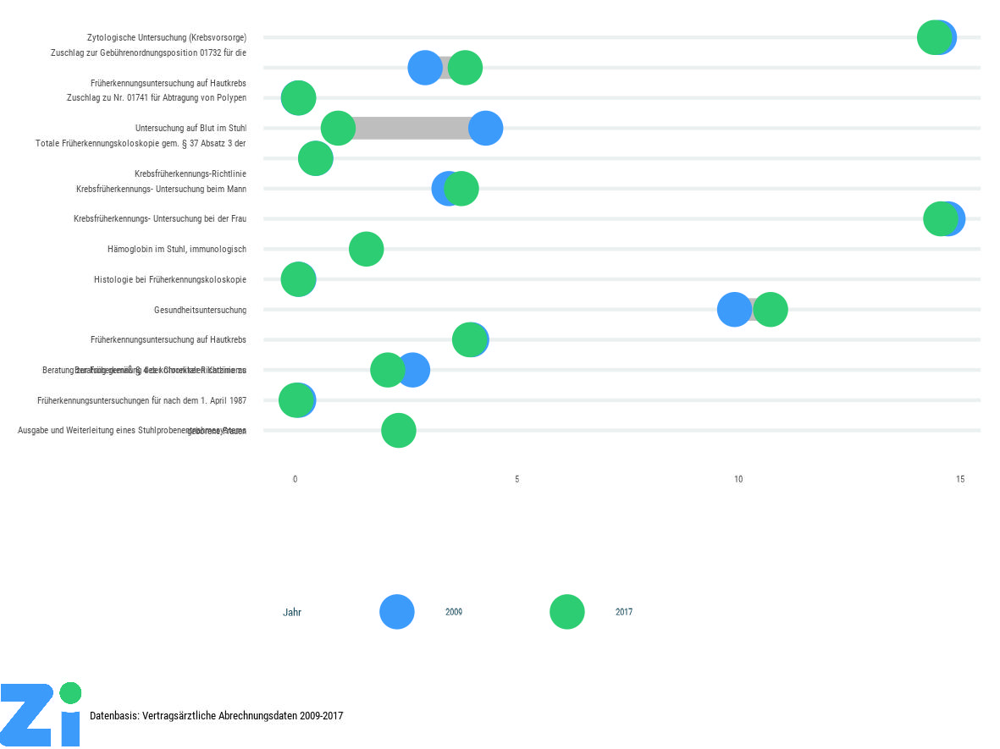

```{r, echo=FALSE}
htmltools::img(src = knitr::image_uri(file.path("../data/logo_zi.png")), 
               alt = 'logo', 
               width = '256' , 
               style = 'position:absolute; top:0; right:0; padding:10px;'
              )
```


# Hintergrund

Das Paket `zicolors` ermöglicht es Grafiken im Stil des Zi Corporate Designs mit dem Paket ggplot2 in R zu erstellen. Es ermöglicht einfache Anpassungen der Syntax und gibt allgemeine Stilvorgaben, die sich am Stil von Infografiken in Zeitungen orientieren. Bei Bedarf steht zudem ein klassischerer Stil zur Verfügung, der eine modernisierte Form von Charts in Excel ist. In dieser Übersicht werden die verschiedenen Anwendungsmöglichkeiten für den Stil dargestellt. 

Der Stil orientiert sich an einem vergleichbaren Stil der [BBC](https://bbc.github.io/rcookbook/).


# Installation

Die Installation des Stiles erfolgt anhand eines im Netzwerk bereitgestellten Paketes mit dem Paket `devtools' von R.

```{r echo=TRUE, message=FALSE, warning=FALSE, paged.print=FALSE}

library("devtools")
library("ggplot2")
library("dplyr")
library("tidyr")
library("readxl")
library("knitr")
library("kableExtra")
library("ggrepel")
library("stringr")
```
```{r echo=TRUE, eval=FALSE}
# Installation des Codes von github
devtools::install_github("zidatalab/zicolors")
```


# Einbindung des Stiles

Zur Anwendung und Installation müssen die R Pakete tidyverse, devtools und showtext verfügbar sein. Die weiteren Libraries sind optional.

## Libraries

Hinweis: Es muss als Fallback zur offiziellen Zi-CD-Schrift für Grafiken "TT Norms Pro Condensed" eine Google Font (Roboto Condensed) installiert werden.

```{r echo=TRUE, message=FALSE, warning=FALSE, paged.print=FALSE}
# Prepare Using package and fonts
library("zicolors")
library("showtext")

font_add_google(name = "Roboto Condensed", family = "Roboto Condensed")

showtext_auto()

```


# Tabellen

Als Beispieldaten für die vorliegenden Analysen wird ein aggregierter Auszug aus der ARGO-Datenstelle zum Theme Krebsfrüherkennung verwendet, der für die Grafik des Monats März 2019 verwendet wird. Linda Zhu hat dazu die Daten aus der ARGO-Datenstelle exportiert.

Es werden zwei Tabellen importiert, die in der mit dem Paket mitgelieferten MS Excel Datei als Reiter implementiert wurden.

```{r echo=TRUE, message=FALSE, warning=FALSE, paged.print=FALSE}
Darmkrebsvorsorge_gesamt <- 
  readxl::read_excel("../data/Darmkrebsvorsorge Anzahl Patienten.xlsx",     
                     sheet = "GOP 01730-01748") %>% gather(Jahr,Patienten,3:dim(.)[2])
Darmkrebsvorsorge_gesamt %>% head() %>% 
   kable() %>%   kable_styling() %>% row_spec(0, bold = T, color = "white", background = zi_cols("ziblaugruen"))

Darmkrebsvorsorge_Patienten <- readxl::read_excel("../data/Darmkrebsvorsorge Anzahl Patienten.xlsx",     
                                                  sheet = "GOP 01741") %>%
  gather(Jahr,Patienten,3:dim(.)[2])  %>% mutate(Patienten=ifelse(Patienten=="<30",NA,as.numeric(Patienten)))
Darmkrebsvorsorge_Patienten %>% head() %>%   kable() %>%
  kable_styling() %>% row_spec(0, bold = T, color = "white", background = zi_cols("ziblaugruen"))
```

# Grafiken
## Grafikstile

Es gibt aktuell drei verschiedene Stile:

* `theme_zi()` (Standard für Infografiken und Präsentationen)
* `theme_zi_axistitles()` (Standard für klassische Grafiken mit Achsenbeschriftung)
* `theme_zi_void()` (Grafiken ohne Achsen und Hilfslinien)

Weiterhin gibt es auch zwei Stile für Grafiken (insbesondere Bar Charts/Säulendiagramme) mit horizontaler Ausrichtung:

* `theme_zi_horizontal`
* `theme_zi_axistitles_horizontal`

## Farboptionen für Skalen in Grafiken

Anhand der ggplot2-Skalen `scale_fill_zi(FARB_NAME)` und  `scale_color_zi(FARB_NAME)` können Plots mit Standard-Farbskalen, die sich an den Vorgaben des Zi Corporate Designs orientieren erzeugt werden. Die Skalen gehen von diskreten Variablen als Basis für die Farbkodierung aus. Sofern Plots auf Basis kontinuierlicher Variablen erzeugt werden sollen, muss die Option `discrete=FALSE` verwendet werden (bspw. also `scale_fill_zi(COLOR_SCHEME_NAME, discrete=FALSE)`).

### Übersicht

```{r,  fig.height = 3, fig.width = 6, fig.align ="left",caption="Übersicht über alle Farbskalen" ,echo=TRUE, message=FALSE, warning=FALSE}
n_col <- 128
img <- function(obj, nam) {
  image(1:length(obj), 1, as.matrix(1:length(obj)), col=obj, 
        main = nam, ylab = "", xaxt = "n", yaxt = "n",  bty = "n")
}

par(mfrow=c(5, 1), mar=rep(1, 4))
img(zi_pal("main")(n_col), "main")
img(zi_pal("main3colors")(n_col), "main3colors")
img(zi_pal("main4colors")(n_col), "main4colors")
img(zi_pal("bluegrey")(n_col), "bluegrey")
img(zi_pal("divergent")(n_col), "divergent")
```

### Gezieltes Anwählen einzelner Farben

Einzelne Farben können mit dem Befehl `zi_cols()` beliebig verwendet werden. Bswp. `zi_cols("zihimmelblau")`.

# Beispiele für Grafiken
## Balkendiagramme
### einfach

Ein simples Balkendiagramm. Wichtig ist, dass beim Diagramm im Standard keine Achensbeschriftungen verwendet werden. Dies setzt voraus, dass der Titel und Untertitel der Abbildung **selbsterklärend** ist. 

```{r , fig.height = 4.5, fig.width = 5 , fig.align ="left", echo=TRUE, message=FALSE, warning=FALSE}
Darmkrebsvorsorge_gesamt %>% filter(GOP=="01741") %>% group_by(Jahr) %>% 
  summarise(Patienten=sum(Patienten, na.rm=T)/1000) %>% 
  ggplot(., aes(x=Jahr,y=Patienten)) + 
  geom_bar(stat="identity", width=0.5, fill=zi_cols("zihimmelblau")) + 
  theme_zi() + 
  labs(title="Patienten mit Früherkennungskoloskopie", subtitle="Anzahl in 1000")
```


### mit Achsenbeschriftungen
Falls das nicht möglich ist, sollte das alternative Thema `theme_zi_axistitles()` verwendet werden, dass Achsenbeschriftungen enthält.


```{r , fig.height = 4.5, fig.width = 7 , fig.align ="left", echo=TRUE, message=FALSE, warning=FALSE}
Darmkrebsvorsorge_gesamt %>% filter(GOP=="01741") %>% group_by(Jahr) %>% 
  summarise(Patienten=sum(Patienten, na.rm=T)/1000) %>% 
  ggplot(., aes(x=Jahr,y=Patienten)) + 
  geom_bar(stat="identity", width=0.5, fill=zi_cols("zihimmelblau")) + 
  theme_zi_axistitles() + 
  labs(y="Früherkennungskoloskopie\nAnzahl in Tsd.", x="Jahr")
```

### Achsenlinien

Sollten **horizontale Achsenlinien** gewünscht sein, können diese mit den Funktion `geom_hline()` erhalten werden. Vertikale Achenlinen können bei Bedarf analog mit `geom_vline()` erzeugt werden.

```{r , fig.height = 4.5, fig.width = 7 , fig.align ="left", echo=TRUE, message=FALSE, warning=FALSE}
Darmkrebsvorsorge_gesamt %>% filter(GOP=="01741") %>% group_by(Jahr) %>% 
  summarise(Patienten=sum(Patienten, na.rm=T)/1000) %>% 
  ggplot(., aes(x=Jahr,y=Patienten)) + 
  geom_bar(stat="identity", width=0.5, fill=zi_cols("zihimmelblau")) + 
  theme_zi_axistitles() + 
  labs(y="Früherkennungskoloskopie\nAnzahl in Tsd.", x="Jahr") + 
  geom_hline(yintercept = 0, size=0.5, col=zi_cols("ziblaugrau")) 
```

### Hervorhebungen

Ein einzelner Balken lässt sich durch einfügen einer `ifelse()` Bedingung hervorheben. Für komplexere Bedingungen kann ggf. das Paket `gghighlights()` genutzt werden ((Link)[https://yutannihilation.github.io/gghighlight/articles/gghighlight.html]).

```{r , fig.height = 4.5, fig.width = 7 , echo=TRUE, message=FALSE, warning=FALSE}
Darmkrebsvorsorge_gesamt %>% filter(GOP=="01741") %>% group_by(Jahr) %>% 
  summarise(Patienten=sum(Patienten, na.rm=T)/1000) %>% 
  ggplot(., aes(x=Jahr,y=Patienten, fill=ifelse(.$Jahr==2013,"blau","grau"))) + 
  geom_bar(stat="identity", width=0.5) + 
  theme_zi_axistitles() + scale_fill_zi("bluegrey") +
  labs(y="Früherkennungskoloskopie\nAnzahl in Tsd.", x="Jahr", fill="") + 
  geom_hline(yintercept = 0, size=0.5, col=zi_cols("ziblaugrau")) 
```

Der gleiche Plot mit horizontaler Ausrichtung:

```{r , fig.height = 4.5, fig.width = 7 , echo=TRUE, message=FALSE, warning=FALSE}
Darmkrebsvorsorge_gesamt %>% filter(GOP=="01741") %>% group_by(Jahr) %>% 
  summarise(Patienten=sum(Patienten, na.rm=T)/1000) %>% 
  ggplot(., aes(x=Jahr,y=Patienten, fill=ifelse(.$Jahr==2013,"blau","grau"))) + 
  geom_bar(stat="identity", width=0.5) + 
  theme_zi_axistitles_horizontal() + scale_fill_zi("bluegrey") +
  labs(y="Früherkennungskoloskopie\nAnzahl in Tsd.", x="Jahr", fill="") + 
  geom_hline(yintercept = 0, size=0.75) +
  coord_flip()
```

## Liniendiagramme


Für die Darstellung von Zeitreihen bietet sich generell eher ein Liniendiagramm an. Generell ist auch hier zu beachten, dass die Eingängigkeit der Darstellung profitiert, wenn die Legende in den Plot integriert wird. 

```{r , fig.height = 4.5, fig.width = 7 , fig.align ="left", echo=TRUE, message=FALSE, warning=FALSE}
plotdata <- Darmkrebsvorsorge_Patienten %>% 
  mutate(Geschlecht=as.character(Geschlecht)) %>% 
  filter(Geschlecht %in% c("männlich","weiblich")) %>%
  group_by(Geschlecht,Jahr) %>% summarise(Patienten=sum(Patienten, na.rm=T)/1000)

  ggplot(plotdata, aes(x=Jahr,y=Patienten, color=Geschlecht, group=Geschlecht)) + 
  geom_line(size=2) +  
  geom_point(shape = 21,size=3,fill="White",stroke=2) + 
  theme_zi() + 
  labs(title="Patienten mit Früherkennungskoloskopie", subtitle="Anzahl in 1000") + 
  scale_color_zi("main") + scale_y_continuous(breaks=seq(100,300,50), 
                                                              limits=c(100,300)) 
```


Um Teilgruppen zu vergleichen, sollte generell die Funktion facets genutzt werden. Die Labels wurden im Plot mit dem Paket `ggrepel` gesetzt, um eine Überschneidung mit den Daten zu verhindern.

```{r , fig.height = 5.5, fig.width = 7 , fig.align ="left" , echo=TRUE, message=FALSE, warning=FALSE}
plotdata <- Darmkrebsvorsorge_Patienten %>% 
  mutate(Geschlecht=as.character(Geschlecht),
         Alter = as.character(Alter)) %>% 
  filter(Geschlecht %in% c("männlich","weiblich")) %>%
  filter(Alter %in% c("40 bis 59 Jahre","60 bis 79 Jahre")) %>%
  group_by(Geschlecht,Alter,Jahr) %>% summarise(Patienten=sum(Patienten, na.rm=T)/1000) 

ggplot(plotdata, aes(x=Jahr,y=Patienten, color=Geschlecht, group=Geschlecht)) + 
  geom_line(size=2) + 
  facet_grid(Alter~. ) + # , scales = "free_y"
  geom_point(shape = 21,size=3,fill="White",stroke=2) + 
  theme_zi() + 
  scale_color_zi("main") 
```

### Kaplan-Meier-Plots (Survivalanalyse)

Etwas komplexer ist die Darstellung der Kaplan-Meier-Kurven bei einer Survivalanalyse. Folgender Code gibt ein Beispiel für die Adaption eines solchen Plots mit dem Paket `survminer` und dem Beispieldatensatz `ovarian`:

```{r, fig.height = 5, fig.width = 7, fig.align ="left", echo=TRUE, message=FALSE, warning=FALSE}
library(survival)
data(ovarian)
library(survminer)

my_surv <- Surv(ovarian$futime, ovarian$fustat) # make a survival-object
my_cox <- coxph(my_surv ~ rx, data=ovarian) # fit a Cox-prop.-hazard-model
my_fit <- survfit(my_surv ~ rx, conf.type="log-log", data=ovarian) # create a survfit-object for plotting

ggsp <- ggsurvplot(my_fit, censor.shape="I")
ggsp_data <- ggsp$plot$data # we need to extract the data from the ggsurvplot-object

ggplot(ggsp_data) + aes(x=time,color=ifelse(strata=="rx=1","Gruppe 1", "Gruppe 2"),y=surv*100) + geom_step(size=2) + scale_color_zi() + theme_zi() + scale_y_continuous(breaks=seq(0,100,10),limits=c(0,100)) + labs(color="",title="Überlebensanalyse",subtitle="Überlebensrate in % nach Tagen") + theme(legend.position = "bottom" )

```

## Boxplots

Boxplots sind besonders geeignet für den Vergleich von Gruppen, wenn nominalskalierte Variablen verglichen werden sollen (und sind oft gegenüber Balkendiagrammen oder Dynamiteplots vorzuziehen).

```{r, fig.height = 4, fig.width = 6, fig.align ="left", echo=TRUE, message=FALSE, warning=FALSE}
data(iris)
library(EnvStats) # to display sample sizes
ggplot(data=iris, aes(x=Species, y=Sepal.Length, fill=Species, color=Species)) + 
  geom_boxplot(lwd=1, fatten=1.5, alpha=.8, show.legend = FALSE) + theme_zi() + 
  scale_fill_zi("main3colors") + scale_color_zi("main3colors") +  
  labs(title="Iris data: species comparison", subtitle="Sepal length in cm") + 
  stat_n_text(y.expand.factor=0.2, size=3.5, family="Roboto Condensed", color = "#194B5A")
```


## Visualisierung von Veränderungen

Um Veränderungen zu visualisieren bieten sich sog. dumbbell charts an. Sie zeigen für heterogene Outcomes Veränderungen zwischen zwei Zeitpunkten an. Wichtig ist bei der Konstruktion darauf zu achten, zuerst die Verbindungliene und anschließend die Punkte zu definieren. Um Labels besser lesbar zu machen, wurde der Plot mit `coord_flip()` gekippt und die Labels mit `stringr::str_trunc()` gekürzt.

```{r, fig.height = 4, fig.width = 8, fig.align ="left", echo=TRUE, message=FALSE, warning=FALSE}
plotdata <- Darmkrebsvorsorge_gesamt %>% filter(Jahr %in% c(min(Jahr),max(Jahr)))  %>% filter(!is.na(Patienten))

dumbbell_plot <- ggplot(plotdata) +aes(x=str_trunc(Beschreibung,60),
           y=Patienten/1000000,
           color=Jahr, 
           group=GOP) + 
    geom_line(color="grey", size=3) +
    geom_point(size=4) + 
    theme_zi(fontsize=14) + scale_color_zi("main") + coord_flip()
  dumbbell_plot
```

# Plots mit integriertem Zi Logo

Mithilfe der Funktion finalise_plot kann das Zi-Logo einem Plot hinzugefügt werden. 

Syntax:

```{r eval=FALSE, include=TRUE, echo=TRUE}
finalise_plot(dumbbell_plot,
 source = "Datenbasis: Vertragsärztliche Abrechnungsdaten 2009-2017",
 width_cm = 20,
 height_cm =20*3/4,
save_filepath = "dumbbell.jpg"
 )
```

```{r include=FALSE, echo=TRUE}
finalise_plot(dumbbell_plot,
 source = "Datenbasis: Vertragsärztliche Abrechnungsdaten 2009-2017",
 width_cm = 10,
 height_cm =10*3/4,
save_filepath = "dumbbell.jpg"
 )
```
{width="100%"}

