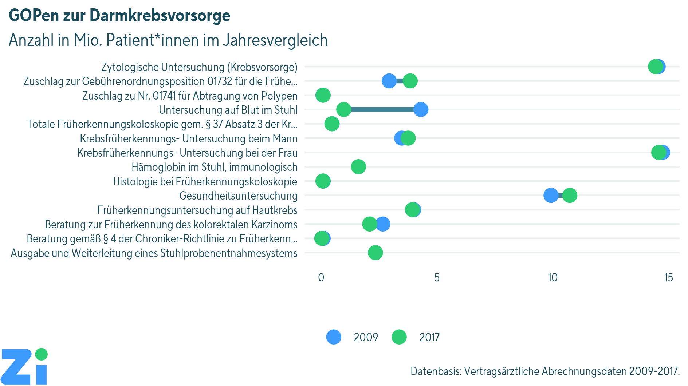
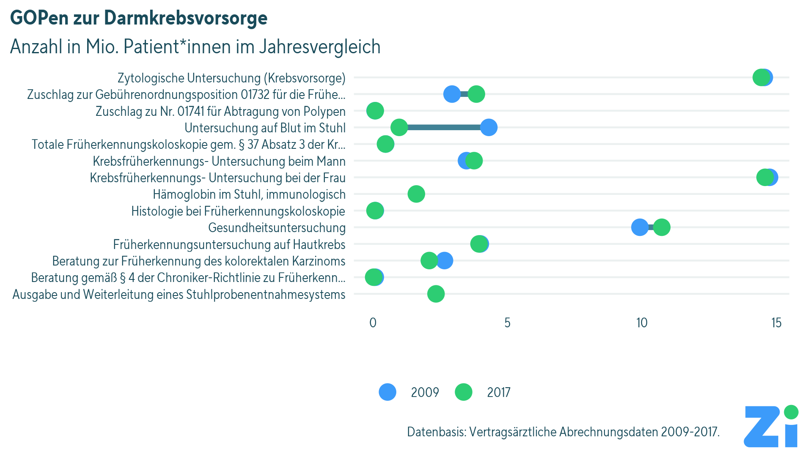

```{r, echo=FALSE}
htmltools::img(src = knitr::image_uri(file.path("../data/logo_zi.png")), 
               alt = 'logo', 
               width = '256' , 
               style = 'position:absolute; top:0; right:0; padding:10px;'
)
```


# Hintergrund

Das Paket `zicolors` ermöglicht es, Grafiken im Stil des Zi-Corporate Designs mit dem Paket `ggplot2` in R zu erstellen. Es ermöglicht einfache Anpassungen der Syntax und gibt allgemeine Stilvorgaben, die sich am Stil von Infografiken in Zeitungen orientieren. In dieser Übersicht werden einige verschiedene Anwendungsmöglichkeiten für den Stil vorgestellt und allgemeine Tipps zum Grafikerstellen gegeben. 

Der Stil orientiert sich an einem vergleichbaren Stil der [BBC](https://bbc.github.io/rcookbook/).

# Installation

Die Installation des Stiles erfolgt anhand eines im Netzwerk bereitgestellten Paketes mit dem Paket `devtools` von R.

```{r echo=TRUE, message=FALSE, warning=FALSE, paged.print=FALSE}

library("devtools")
library("ggplot2")
library("dplyr")
library("tidyr")
library("readxl")
library("knitr")
library("kableExtra")
library("ggrepel")
library("stringr")
```
```{r echo=TRUE, eval=FALSE}
# Installation des Codes von github
devtools::install_github("zidatalab/zicolors")
```


# Einbindung des Stiles

Zur Anwendung und Installation müssen die R-Pakete `tidyverse`, `devtools` und `showtext` verfügbar sein. Weitere optionale Pakete sind `ggrepel` (für Labels), `kableExtra` (für Tabellen), sowie `magick` (zum Hinzufügen des Zi-Logos).

## Libraries

Hinweis: Es muss eventuell als Fallback zur offiziellen Zi-CD-Schrift für Grafiken "TT Norms Pro Condensed" eine Google Font (Roboto Condensed) heruntergeladen/installiert werden.

Das Einbinden einer im System installierten (Nicht-Standard-)Schrift ist in R nicht trivial. Wir arbeiten an einer möglichst gut verwendbaren Lösung!

```{r echo=TRUE, message=FALSE, warning=FALSE, paged.print=FALSE}
# Prepare Using package and fonts
library("zicolors")
library("showtext")

font_add_google(name = "Roboto Condensed", family = "Roboto Condensed")

showtext_auto()
```


# Tabellen

Als Beispieldaten für die vorliegenden Analysen wird ein aggregierter Auszug aus der ARGO-Datenstelle zum Theme Krebsfrüherkennung verwendet, der für die Grafik des Monats März 2019 verwendet wurde. Linda Zhu hat dazu die Daten aus der ARGO-Datenstelle exportiert.

Es werden zwei Tabellen importiert, die in der mit dem Paket mitgelieferten MS Excel Datei als Reiter implementiert wurden.

```{r echo=TRUE, message=FALSE, warning=FALSE, paged.print=FALSE}
Darmkrebsvorsorge_gesamt <- 
  readxl::read_excel("../data/Darmkrebsvorsorge Anzahl Patienten.xlsx",     
                     sheet = "GOP 01730-01748") %>% gather(Jahr,Patienten,3:dim(.)[2])
Darmkrebsvorsorge_gesamt %>% head() %>% 
  kable() %>%   kable_styling() %>% row_spec(0, bold = T, color = "white", background = zi_cols("ziblaugruen"))

Darmkrebsvorsorge_Patienten <- readxl::read_excel("../data/Darmkrebsvorsorge Anzahl Patienten.xlsx",     
                                                  sheet = "GOP 01741") %>%
  gather(Jahr,Patienten,3:dim(.)[2])  %>% mutate(Patienten=ifelse(Patienten=="<30",NA,as.numeric(Patienten)))
Darmkrebsvorsorge_Patienten %>% head() %>%   kable() %>%
  kable_styling() %>% row_spec(0, bold = T, color = "white", background = zi_cols("ziblaugruen"))
```

# Grafiken
## Grafikstile

Es gibt aktuell drei verschiedene Stile:

* `theme_zi()` (Standard für Infografiken und Präsentationen)
* `theme_zi_axistitles()` (für klassische Grafiken mit Achsenbeschriftung)
* `theme_zi_void()` (Grafiken ohne Achsen und Hilfslinien)

Weiterhin gibt es auch zwei Stile für Grafiken (insbesondere Bar Charts/Säulendiagramme) mit horizontaler Ausrichtung:

* `theme_zi_horizontal`
* `theme_zi_axistitles_horizontal`

## Farboptionen für Skalen in Grafiken

Anhand der ggplot2-Skalen `scale_fill_zi(PALETTENNAME)` und  `scale_color_zi(PALETTENNAME)` können Plots mit Standard-Farbskalen, die sich an den Vorgaben des Zi-Corporate Designs orientieren, erzeugt werden. Die Skalen gehen von diskreten Variablen als Basis für die Farbkodierung aus. Sofern Plots auf Basis kontinuierlicher Variablen erzeugt werden sollen, muss die Option `discrete=FALSE` verwendet werden (bspw. also `scale_fill_zi(COLOR_SCHEME_NAME, discrete=FALSE)`).

### Übersicht

```{r,  fig.height = 3, fig.width = 6, fig.align ="left",caption="Übersicht über alle Farbskalen" ,echo=TRUE, message=FALSE, warning=FALSE}
n_col <- 128
img <- function(obj, nam) {
  image(1:length(obj), 1, as.matrix(1:length(obj)), col=obj, 
        main = nam, ylab = "", xaxt = "n", yaxt = "n",  bty = "n")
}

par(mfrow=c(5, 1), mar=rep(1, 4))
img(zi_pal("main")(2), "main")
img(zi_pal("shadesofblue")(n_col), "shadesofblue")
img(zi_pal("shadesofgreen")(n_col), "shadesofgreen")
img(zi_pal("intensity")(n_col), "intensity")
img(zi_pal("divergent")(n_col), "divergent")
```

### Gezieltes Anwählen einzelner Farben

Einzelne Farben können mit dem Befehl `zi_cols()` beliebig verwendet werden, z.B. `zi_cols("zihimmelblau")`. Achtung, die im Corporate Design vorgeschlagene Farbe für Hervorhebungen (`zi_cols("zisignalrot")`) ist sehr sparsam einzusetzen und sollte nur für `r kableExtra::text_spec("Texthervorhebungen", color = zi_cols("zisignalrot"))` oder einen einzelnen Datenpunkt benutzt werden. Soll in einer Grafik ein Balken oder eine Linie gegenüber anderen Balken/Linien hervorgehoben werden, sollte die Standardfarbe `zi_cols("zihimmelblau")` im Kontrast zu helleren Farben (z.B. `zi_cols("zihimmelblauhell")` verwendet werden (siehe auch weiter unten).

# Beispiele für Grafiken
## Balkendiagramme
### Standard

Wichtig ist, dass beim einfachen Balkendiagramm im Standard keine Achsenbeschriftungen verwendet werden. Dies setzt voraus, dass der Titel und Untertitel der Abbildung **selbsterklärend** ist. 

Außerdem sollte nach dem Corporate Design die Breite der Säulen verringert werden (z.B. hier mit `width=0.5` innerhalb von `geom_bar()`), sowie eine Grundlinie hinzugefügt werden (mit `geom_hline(yintercept = 0, size=0.5, col=zi_cols("ziblaugruen"))`).

```{r , fig.height = 4.5, fig.width = 5 , fig.align ="left", echo=TRUE, message=FALSE, warning=FALSE}
Darmkrebsvorsorge_gesamt %>% filter(GOP=="01741") %>% group_by(Jahr) %>% 
  summarise(Patienten=sum(Patienten, na.rm=T)/1000) %>% 
  ggplot(., aes(x=Jahr,y=Patienten)) + 
  geom_bar(stat="identity", width=0.5, fill=zi_cols("zihimmelblau")) + 
  theme_zi() + 
  labs(title="Patient*innen mit Früherkennungskoloskopie", subtitle="Anzahl in 1.000") + 
  geom_hline(yintercept = 0, size=0.5, col=zi_cols("ziblaugruen")) +
  coord_cartesian(clip ="off") +
  geom_segment(x = 0.4, xend = 9.5,
               y = 538, yend = 538,
               color=zi_cols("ziblaugruen"), size=0.1)
```


### mit Achsenbeschriftungen

Generell ist die oben beschriebene Art ohne Achsentitel vorzuziehen. Falls das nicht möglich ist (z.B. bei Grafiken ohne Titel), sollte das alternative Thema `theme_zi_axistitles()` verwendet werden, dass Achsenbeschriftungen enthält.


```{r , fig.height = 4.5, fig.width = 7 , fig.align ="left", echo=TRUE, message=FALSE, warning=FALSE}
Darmkrebsvorsorge_gesamt %>% filter(GOP=="01741") %>% group_by(Jahr) %>% 
  summarise(Patienten=sum(Patienten, na.rm=T)/1000) %>% 
  ggplot(., aes(x=Jahr,y=Patienten)) + 
  geom_bar(stat="identity", width=0.5, fill=zi_cols("zihimmelblau")) + 
  theme_zi_axistitles() + 
  labs(y="Früherkennungskoloskopie\nAnzahl in Tsd.", x="Jahr") + 
  geom_hline(yintercept = 0, size=0.5, col=zi_cols("ziblaugruen")) 
```

### Hervorhebungen

Ein einzelner Balken lässt sich durch Einfügen einer `ifelse()` Bedingung hervorheben.

```{r , fig.height = 4.5, fig.width = 7 , echo=TRUE, message=FALSE, warning=FALSE}
Darmkrebsvorsorge_gesamt %>% filter(GOP=="01741") %>% group_by(Jahr) %>% 
  summarise(Patienten=sum(Patienten, na.rm=T)/1000) %>% 
  ggplot(., aes(x=Jahr,y=Patienten, fill=ifelse(.$Jahr==2013,"blau","hellblau"))) + 
  geom_bar(stat="identity", width=0.5) + 
  theme_zi_axistitles() + 
  scale_fill_manual(values=unname(c(
    zi_cols("zihimmelblau"), zi_cols("zihimmelblauhell")
  ))) +
  labs(y="Früherkennungskoloskopie\nAnzahl in Tsd.", x="Jahr", fill="") + 
  geom_hline(yintercept = 0, size=0.5, col=zi_cols("ziblaugruen")) 
```

Der gleiche Plot mit horizontaler Ausrichtung:

```{r , fig.height = 4.5, fig.width = 7 , echo=TRUE, message=FALSE, warning=FALSE}
Darmkrebsvorsorge_gesamt %>% filter(GOP=="01741") %>% group_by(Jahr) %>% 
  summarise(Patienten=sum(Patienten, na.rm=T)/1000) %>% 
  ggplot(., aes(x=Jahr,y=Patienten, fill=ifelse(.$Jahr==2013,"blau","hellblau"))) + 
  geom_bar(stat="identity", width=0.5) + 
  theme_zi_axistitles_horizontal() + 
    scale_fill_manual(values=unname(c(
    zi_cols("zihimmelblau"), zi_cols("zihimmelblauhell")
  ))) +
  labs(y="Früherkennungskoloskopie\nAnzahl in Tsd.", x="Jahr", fill="") + 
  geom_hline(yintercept = 0, size=0.5, col=zi_cols("ziblaugruen")) +
  coord_flip()
```

### Stacked Bar Charts

Hierbei handelt es sich um ein Balkendiagramm mit einer Gruppierung innerhalb der Balken. Durch das Corporate Design sind standardmäßig nur zwei qualitativ unterschiedliche Gruppen möglich (mit den Hauptfarben `zi_cols("zihimmelblau")` und `zi_cols("zilindgruen")`). Sollten mehr Farben benötigt werden, müssen diese manuell mit `scale_fill_manual()` (bzw. `scale_color_manual()`) und der benötigten Anzahl von verfügbaren `zi_cols()` ausgewählt werden. 

```{r, fig.height = 4.5, fig.width = 7 , echo=TRUE, message=FALSE, warning=FALSE}
set.seed(42)
beispieldaten <- tibble(X=sample(LETTERS[1:4], 1000, replace=TRUE),
                        G=sample(letters[1:3], 1000, replace=TRUE))

beispieldaten_summed <- beispieldaten %>% 
  count(X, G)

ggplot(beispieldaten_summed,
       aes(x=X,
           y=n,
           fill=G)) + 
  geom_bar(stat="identity", width=0.5, color="white") + 
  scale_fill_manual(values=unname(c(
    zi_cols("zihimmelblau"),
    zi_cols("zilindgruen"),
    zi_cols(("zihimmelblaudunkel"))))) +
  theme_zi() +
  labs(fill="", 
       title="Stacked Bar Chart",
       subtitle="Anzahl") + 
  geom_hline(yintercept = 0, size=0.5, col=zi_cols("ziblaugruen"))
```

Zusätzlich können die Gesamtzahlen in fett über den Balken erscheinen, sowie die Anzahlen der einzelnen Gruppen als Labels neben den Balken. Die Hilfslinien und die y-Achse werden dann nicht mehr benötigt! Auf jeden Fall muss aber mit verschiedenen Parametern experimentiert werden, insbesondere mit der Balkenbreite `width` innerhalb `geom_bar()`, mit der Schriftgröße `size` der Zahlenlabels innerhalb `geom_text` sowie ebendort mit `nudge_x` und `point.padding` für die Länge der Linien.

```{r, fig.height = 4.5, fig.width = 7 , echo=TRUE, message=FALSE, warning=FALSE}
beispieldaten_summed_withposition <- beispieldaten_summed %>% 
  group_by(X) %>% 
  arrange(rev(G), .by_group = TRUE) %>% 
  mutate(myposition=cumsum(n)-n/2) %>% 
  ungroup()

ggplot(beispieldaten_summed_withposition,
       aes(x=X,
           y=n,
           fill=G)) + 
  geom_bar(stat="identity", width=0.4, color="white") + 
  scale_fill_manual(values=unname(c(
    zi_cols("zihimmelblau"),
    zi_cols("zilindgruen"),
    zi_cols(("zihimmelblaudunkel"))))) +
  theme_zi() +
  labs(fill="", 
       title="Stacked Bar Chart",
       subtitle="Anzahl") + 
  geom_text(aes(label=after_stat(y), group=X),
            stat='summary', fun=sum, vjust = -1,
            family="Roboto Condensed", fontface="bold", 
            size=3,
            color=zi_cols("ziblaugruen")) +
  geom_text_repel(aes(label=n, y=myposition),
            family="Roboto Condensed", color=zi_cols("ziblaugruen"),
            size=3,
            nudge_x = -0.38,
            point.padding = 3.5) +
  theme(axis.text.y = element_blank(),
        panel.grid.major.y = element_blank()) +
  coord_cartesian(clip = "off") +
  geom_hline(yintercept = 0, size=0.5, col=zi_cols("ziblaugruen"))
```

## Liniendiagramme

Für die Darstellung von Zeitreihen bietet sich im Allgemeinen eher ein Liniendiagramm an.

Generell gilt für eine "gute" Grafik", dass überflüssiges und doppeltes vermieden wird: Hier ist es z.B. überflüssig, der Legende den Titel "Geschlecht" voranzustellen (mit `color=""` innerhalb von `labs()`).

```{r , fig.height = 4.5, fig.width = 7 , fig.align ="left", echo=TRUE, message=FALSE, warning=FALSE}
plotdata <- Darmkrebsvorsorge_Patienten %>% 
  mutate(Geschlecht=as.character(Geschlecht)) %>% 
  filter(Geschlecht %in% c("männlich","weiblich")) %>%
  group_by(Geschlecht,Jahr) %>% summarise(Patienten=sum(Patienten, na.rm=T)/1000)

ggplot(plotdata, aes(x=Jahr,y=Patienten, color=Geschlecht, group=Geschlecht)) + 
  geom_line(size=2) +  
  geom_point(shape = 21,size=3,fill="White",stroke=2) + 
  theme_zi() + 
  ylim(0, NA) +
  labs(title="Patient*innen mit Früherkennungskoloskopie", subtitle="Anzahl in 1000",
       color="") + 
  scale_color_zi("main") + scale_y_continuous(breaks=seq(0,300,50), 
                                              limits=c(0,300)) 
```

Empfohlen ist es aber hier, die Legenden-Labels direkt in den Plot zu integrieren. Die Labels wurden im Plot mit dem Paket `ggrepel` und der Funktion `geom_text_repel` gesetzt, um eine Überschneidung mit den Daten zu verhindern. Die Legende wird dann nicht mehr benötigt (`legend.position = "none"` innerhalb von `theme()`). Eventuell muss mit den Parametern innerhalb von `geom_text_repel` experimentiert werden.

```{r , fig.height = 4.5, fig.width = 7 , fig.align ="left", echo=TRUE, message=FALSE, warning=FALSE}
plotdata <- Darmkrebsvorsorge_Patienten %>% 
  mutate(Geschlecht=as.character(Geschlecht)) %>% 
  filter(Geschlecht %in% c("männlich","weiblich")) %>%
  group_by(Geschlecht,Jahr) %>% summarise(Patienten=sum(Patienten, na.rm=T)/1000)

ggplot(plotdata, aes(x=Jahr,y=Patienten,
                     color=Geschlecht, group=Geschlecht, label=Geschlecht)) + 
  geom_line(size=2) +  
  geom_point(shape = 21,size=3,fill="White",stroke=2) + 
  theme_zi() +
  theme(legend.position = "none") +
  ylim(0, NA) +
  labs(title="Patient*innen mit Früherkennungskoloskopie", subtitle="Anzahl in 1.000") + 
  scale_color_zi("main") +
  scale_y_continuous(breaks=seq(0,300,50), 
                     limits=c(0,300)) +
  geom_text_repel(data = . %>% filter (Jahr == max(Jahr)), 
                  seed = 1,
                  family="Roboto Condensed", 
                  size = 4,
                  point.padding = 20, ## wenig padding
                  direction = 'y',
                  nudge_y = c(0,0,1,1),
                  force_pull = 100)
```

Um Teilgruppen zu vergleichen, sollte am besten die facet-Funktion (`facet_wrap()` oder `facet_grid()`) genutzt werden. Hier ist es besser, einmal die Legende zu plotten als an jeder Facet die Labels zu verwenden (doppeltes soll vermieden werden).

```{r , fig.height = 5.5, fig.width = 7 , fig.align ="left" , echo=TRUE, message=FALSE, warning=FALSE}
plotdata <- Darmkrebsvorsorge_Patienten %>% 
  mutate(Geschlecht=as.character(Geschlecht),
         Alter = as.character(Alter)) %>% 
  filter(Geschlecht %in% c("männlich","weiblich")) %>%
  filter(Alter %in% c("40 bis 59 Jahre","60 bis 79 Jahre")) %>%
  group_by(Geschlecht,Alter,Jahr) %>% summarise(Patienten=sum(Patienten, na.rm=T)/1000) 

ggplot(plotdata, aes(x=Jahr,y=Patienten, color=Geschlecht, group=Geschlecht)) + 
  geom_line(size=2) + 
  facet_grid(Alter~. ) + # , scales = "free_y"
  geom_point(shape = 21,size=3,fill="White",stroke=2) + 
  theme_zi() + 
  ylim(0, NA) + 
  labs(title="Patient*innen mit Früherkennungskoloskopie", subtitle="Anzahl in 1.000",
       color="") +
  scale_color_zi("main") 
```

### Kaplan-Meier-Plots (Survivalanalyse)

Etwas komplexer ist die Darstellung der Kaplan-Meier-Kurven bei einer Survivalanalyse. Folgender Code gibt ein Beispiel für die Adaption eines solchen Plots mit dem Paket `survminer` und dem Beispieldatensatz `ovarian`:

```{r, fig.height = 5, fig.width = 7, fig.align ="left", echo=TRUE, message=FALSE, warning=FALSE}
library(survival)
data(ovarian)
library(survminer)

my_surv <- Surv(ovarian$futime, ovarian$fustat) # make a survival-object
my_cox <- coxph(my_surv ~ rx, data=ovarian) # fit a Cox-prop.-hazard-model
my_fit <- survfit(my_surv ~ rx, conf.type="log-log", data=ovarian) # create a survfit-object for plotting

ggsp <- ggsurvplot(my_fit, censor.shape="I")
ggsp_data <- ggsp$plot$data # we need to extract the data from the ggsurvplot-object

ggplot(ggsp_data) + aes(x=time,color=ifelse(strata=="rx=1","Gruppe 1", "Gruppe 2"),y=surv*100) + geom_step(size=2) + scale_color_zi() + theme_zi() + scale_y_continuous(breaks=seq(0,100,10),limits=c(0,100)) + labs(color="",title="Überlebensanalyse",subtitle="Überlebensrate in % nach Tagen") + theme(legend.position = "bottom" )

```

## Boxplots

Boxplots sind besonders geeignet für den Vergleich von Gruppen, wenn nominalskalierte Variablen verglichen werden sollen (und sind oft gegenüber Balkendiagrammen oder Dynamiteplots vorzuziehen).

```{r, fig.height = 4, fig.width = 6, fig.align ="left", echo=TRUE, message=FALSE, warning=FALSE}
data(iris)
library(EnvStats) # to display sample sizes
ggplot(data=iris, aes(x=Species, y=Sepal.Length, fill=Species, color=Species)) + 
  geom_boxplot(lwd=1, fatten=1.5, alpha=.8, show.legend = FALSE) + theme_zi() + 
    scale_fill_manual(values=unname(c(
    zi_cols("zihimmelblau"),
    zi_cols("zilindgruen"),
    zi_cols(("zihimmelblaudunkel"))))) +
  scale_color_manual(values=unname(c(
    zi_cols("zihimmelblau"),
    zi_cols("zilindgruen"),
    zi_cols(("zihimmelblaudunkel"))))) +
  labs(title="Iris data: species comparison", subtitle="Sepal length in cm") + 
  ylim(0, NA) +
  stat_n_text(y.expand.factor=0.2, size=3.5, family="Roboto Condensed", color = "#194B5A")
```


## Visualisierung von Veränderungen

Um Veränderungen zu visualisieren bieten sich sog. dumbbell charts an. Sie zeigen für heterogene Outcomes Veränderungen zwischen zwei Zeitpunkten an. Wichtig ist bei der Konstruktion darauf zu achten, zuerst die Verbindunglinie und anschließend die Punkte zu definieren. Um Labels besser lesbar zu machen, wurde der Plot mit `coord_flip()` gekippt und die Labels mit `stringr::str_trunc()` gekürzt.

```{r, fig.height = 4, fig.width = 8, fig.align ="left", echo=TRUE, message=FALSE, warning=FALSE}
plotdata <- Darmkrebsvorsorge_gesamt %>% 
  filter(Jahr %in% c(min(Jahr),max(Jahr))) %>%
  filter(!is.na(Patienten))

dumbbell_plot <- ggplot(plotdata) +aes(x=str_trunc(Beschreibung,60),
                                       y=Patienten/1000000,
                                       color=Jahr, 
                                       group=GOP) + 
  geom_line(color=zi_cols("ziblaugrauhell"), linewidth=3) +
  geom_point(size=4) + 
  labs(title="GOPen zur Darmkrebsvorsorge",
       subtitle="Anzahl in Mio. Patient*innen im Jahresvergleich",
       color="") +
  theme_zi() + scale_color_zi("main") + coord_flip()
dumbbell_plot
```

# Plots mit Quellenangabe

Soll einer Grafik die Quelle/Datengrundlage hinzugefügt werden, kann das direkt in `ggplot2` mit einer `caption` erledigt werden. Die Quelle steht automatisch wie vom Coroporate Design verlangt unten rechts. Diese Form ist die Grundlage für die Grafik des Monats und kann in druckfähiger Auflösung (300 dpi) mit `ggsave()` gespeichert werden, dafür muss allerdings vorher mit `showtext_opts(dpi = 300)` sichergestellt werden, dass die geladene Schriftart richtig in die Grafik integriert wird:

```{r, fig.height = 4, fig.width = 8, fig.align ="left", echo=TRUE, message=FALSE, warning=FALSE}
dumbbell_plot_mitcaption <- dumbbell_plot +
  labs(caption="Datenbasis: Vertragsärztliche Abrechnungsdaten 2009-2017.")

showtext_opts(dpi = 300)

ggsave("data/dumbbell.png", 
       plot=dumbbell_plot_mitcaption, 
       width=16, height=9,
       units="cm", dpi=300)
```
{width="100%"}


# Plots mit integriertem Zi-Logo

Mithilfe der Funktionen `finalise_plot_logorechts` / `finalise_plot_logolinks` und dem Package `magick` können das Zi-Logo und eine Angabe zu Quellen/Datengrundlagen einem Plot hinzugefügt werden, sowie eine druckfähige Kopie der Grafik (300 dpi) gespeichert werden.

Syntax für Logo links:

```{r include=TRUE, echo=TRUE}
library(magick)
finalise_plot_logolinks(plot_name = dumbbell_plot,
                        source_name = "Datenbasis: Vertragsärztliche Abrechnungsdaten 2009-2017.",
                        width = 16,
                        height = 9,
                        save_filepath = "data/dumbbell_logolinks.png"
)
```
{width="100%"}

Sollte das Logo rechts stehen (wenn links nicht genug Freiraum ist, weil z.B. die Legende im Weg ist), wird die Syntax für die Platzierung des Logos etwas komplexer, weil die Quellenangabe etwas links vom Logo stehen sollte. Eventuell muss hier mit dem Parameter `hjust_source` zwischen 0 und 1 experimentiert werden:

```{r include=TRUE, echo=TRUE}
library(magick)
finalise_plot_logorechts(plot_name = dumbbell_plot,
                         source_name = "Datenbasis: Vertragsärztliche Abrechnungsdaten 2009-2017.",
                         width = 16,
                         height = 9,
                         hjust_source = 0.2,
                         save_filepath = "data/dumbbell_logorechts.png"
)
```
{width="100%"}